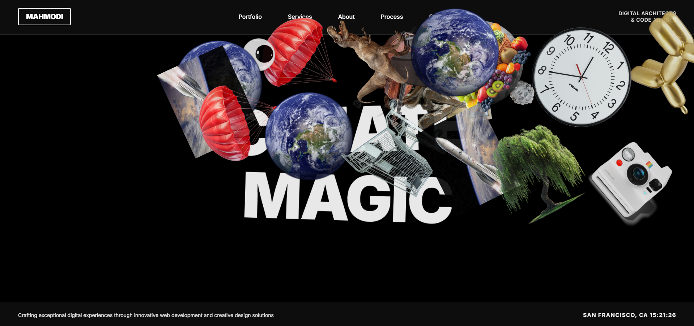

# Mahmodi - Interactive Web Development Agency Website

<div align="center">
  
  
  **A modern, interactive website showcasing dynamic animations and mouse-trail effects**
  
  <br>

[🔗 **Live Demo** →](https://mohdyahyamahmodi.github.io/agency-website/)

  <br>
  
  
</div>
  
  [](https://opensource.org/licenses/MIT)
  [](https://greensock.com/gsap/)
  [](https://developer.mozilla.org/en-US/docs/Web/JavaScript)
</div>

## 🎯 Overview

Mahmodi is a cutting-edge web development agency website that demonstrates modern web technologies through:

- **Dynamic word animations** with smooth GSAP transitions
- **Color-cycling backgrounds** with adaptive text colors
- **Interactive mouse trail images** that follow your cursor
- **Responsive design** optimized for all devices
- **Real-time clock** displaying current time
- **Glassmorphism UI** with backdrop filters

## ✨ Features

### 🎭 Core Animations

- **Word Cycling**: Automatically transitions between web development-related word pairs
- **Background Colors**: Smooth transitions through a curated pastel color palette
- **Text Adaptation**: Intelligently switches between light/dark text based on background
- **Entrance Effects**: Bouncy, staggered animations for initial page load

### 🖱️ Interactive Elements

- **Mouse Trail Images**: Random images appear and rotate at cursor position
- **Throttled Spawning**: Performance-optimized image creation
- **Auto-cleanup**: Images disappear after 2 seconds to prevent memory leaks
- **Desktop Only**: Mouse effects disabled on mobile for better performance

### 📱 Responsive Design

- **Mobile-First**: Optimized layouts for all screen sizes
- **Touch-Friendly**: Enhanced button sizes and spacing on mobile
- **Adaptive Typography**: Fluid font sizing using CSS clamp()

## 🛠️ Technical Implementation

### Architecture

```
┌─ HTML Structure ─┐
│ ├─ Header        │ ← Logo, Navigation, Tagline
│ ├─ Main Content  │ ← Animated Words
│ └─ Footer        │ ← Description, Clock
└───────────────────┘

┌─ JavaScript Logic ─┐
│ ├─ Configuration   │ ← Constants, Settings
│ ├─ State Mgmt      │ ← Global Variables
│ ├─ Utilities       │ ← Helper Functions
│ ├─ Core Features   │ ← Main Functionality
│ └─ Initialization  │ ← Startup Sequence
└────────────────────┘
```

### Key Technologies

| Technology                | Purpose                          | Version |
| ------------------------- | -------------------------------- | ------- |
| **GSAP**                  | Smooth animations and transforms | 3.12.2  |
| **CSS Grid/Flexbox**      | Layout and positioning           | Native  |
| **CSS Custom Properties** | Dynamic theming                  | Native  |
| **ES6+ JavaScript**       | Modern syntax and features       | Latest  |
| **Google Fonts**          | Typography (Inter font)          | Web API |

### Animation System

```javascript
// Example: Word transition animation
gsap
  .timeline()
  .to(words, { opacity: 0, y: -120, rotation: -20 }) // Exit
  .set(words, { textContent: newWords }) // Update
  .fromTo(
    words,
    { opacity: 0, y: 140, rotation: 25 }, // Enter from
    { opacity: 1, y: 0, rotation: 0 } // Enter to
  );
```

## 🚀 Setup & Installation

### Prerequisites

- Modern web browser with ES6+ support
- Local web server (recommended for development)
- Image files for mouse trail effect

### Quick Start

1. **Clone the repository**

   ```bash
   git clone https://github.com/your-username/mahmodi-website.git
   cd mahmodi-website
   ```

2. **Prepare your images**
   Create an `images.json` file with your image URLs:

   ```json
   {
     "images": [
       "https://example.com/image1.png",
       "https://example.com/image2.png",
       "path/to/local/image.png"
     ]
   }
   ```

3. **Launch the website**

   ```bash
   # Using Python
   python -m http.server 8000

   # Using Node.js
   npx serve .

   # Or simply open index.html in your browser
   ```

4. **Access the site**
   Open `http://localhost:8000` in your browser

## ⚙️ Configuration

### Customizing Word Pairs

Edit the `WORD_PAIRS` constant in the JavaScript:

```javascript
const WORD_PAIRS = [
  ["YOUR", "WORDS"],
  ["CUSTOM", "PAIRS"],
  ["ADD", "MORE"],
];
```

### Adjusting Colors

Modify the `COLOR_PALETTE` array:

```javascript
const COLOR_PALETTE = ["#your-color-1", "#your-color-2", "#your-color-3"];
```

### Performance Settings

Fine-tune in the `SETTINGS` object:

```javascript
const SETTINGS = {
  mouseThrottle: 25, // Lower = more images
  imageLifetime: 2000, // How long images stay visible
  wordChangeInterval: 4000, // Speed of word changes
  timeUpdateInterval: 1000, // Clock update frequency
};
```

## 🎨 Styling Customization

### Typography

The site uses the Inter font family. To change:

```css
body {
  font-family: "Your-Font", sans-serif;
}
```

### Image Sizing

Adjust maximum dimensions for trail images:

```css
.trail-image {
  max-width: 350px; /* Increase for larger images */
  max-height: 350px; /* Maintain aspect ratio */
}
```

### Responsive Breakpoints

Modify breakpoints in the media queries:

```css
@media (max-width: 768px) {
  /* Tablet */
}
@media (max-width: 480px) {
  /* Mobile */
}
```

## 📂 File Structure

```
mahmodi-website/
├── index.html          # Main HTML file
├── images.json         # Image URLs for mouse trail
├── favicon.png         # Site favicon
├── image1.png          # Screenshot for README
├── README.md           # This documentation
└── assets/
    └── images/         # Local image assets (optional)
```

## 🔧 Browser Compatibility

| Browser | Minimum Version     | Notes                  |
| ------- | ------------------- | ---------------------- |
| Chrome  | 60+                 | Full support           |
| Firefox | 55+                 | Full support           |
| Safari  | 12+                 | Full support           |
| Edge    | 79+                 | Full support           |
| Mobile  | iOS 12+, Android 7+ | Mouse effects disabled |

## 🚀 Performance Considerations

- **Image Throttling**: Prevents excessive image creation
- **Auto-cleanup**: Images are removed after their lifetime
- **Mobile Optimization**: Mouse effects disabled on touch devices
- **Efficient Selectors**: Cached DOM references
- **RAF Optimization**: GSAP handles animation timing

## 🤝 Contributing

We welcome contributions! Areas for improvement:

- [ ] Implement prefers-reduced-motion support
- [ ] Add more animation presets
- [ ] Create configuration GUI
- [ ] Improve mobile interactions

### Development Setup

1. Fork the repository
2. Create a feature branch: `git checkout -b feature-name`
3. Make your changes
4. Test across different browsers and devices
5. Submit a pull request

## 📄 License

This project is licensed under the MIT License - see the [LICENSE](LICENSE) file for details.

## 🙏 Acknowledgments

- **GSAP** for incredible animation capabilities
- **Google Fonts** for beautiful typography
- **Modern CSS** features for advanced styling
- **Community feedback** for continuous improvement

---

<div align="center">
  <b>Built with ❤️ by the Mahmodi Team</b>
  
  [🌐 Live Demo](https://mahmodi.com) • [📧 Contact](mailto:hello@mahmodi.com) • [🐛 Report Bug](https://github.com/your-username/mahmodi-website/issues)
</div>
